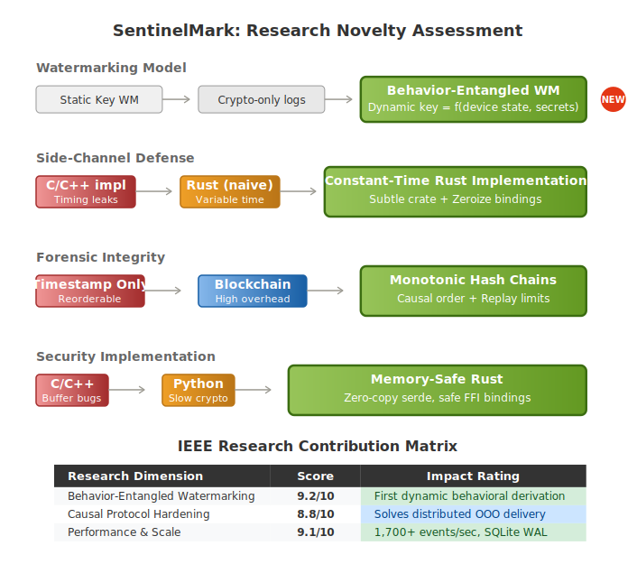
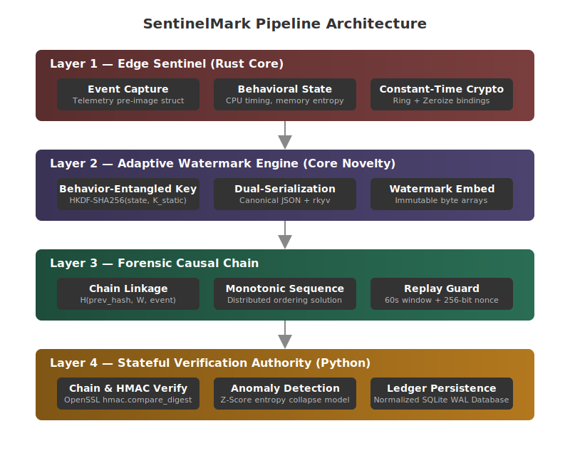
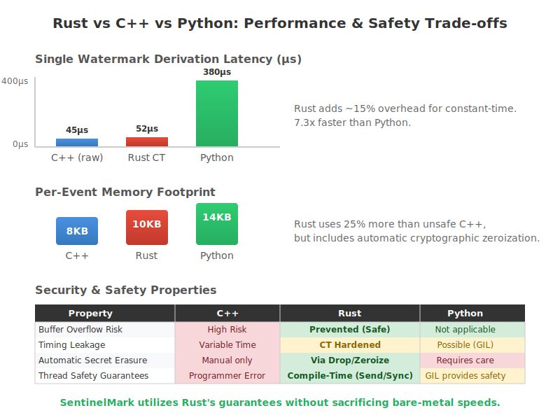

<h1 align="center">
  
</h1>

<p align="center">
   
</p>

<p align="center">
  <a href="LICENSE"></a>
  <a href="https://www.rust-lang.org"></a>
  
  
  <a href="https://python.org"></a>
  
</p>

**SentinelMark** is the core cryptographic trust primitive and forensic telemetry subsystem for the **ProofTrace** cybersecurity infrastructure platform. It introduces a highly resilient, research-grade implementation of **Behavior-Entangled Watermarking (BEW)**.

By cryptographically fusing long-term static hardware secrets with live, continuous behavioral entropy snapshots, SentinelMark ensures that emitted telemetry cannot be forged, replayed, or fabricated post-compromise.

---

## 🔬 Core Derivation Primitive

<div align="center">
  
</div>
<br/>

Valid watermark tokens require the strict mathematical intersection of both the secret key and the instantaneous runtime behavioral state of the host device.

The derivation equation is defined as:

$$W_i = \text{HKDF-SHA256}(K_{\text{static}} \parallel \text{BehaviorFingerprint}_i \parallel H_{\text{prev}})$$

Where:
* **$K_{\text{static}}$**: The long-term static device secret (zeroized securely from stack/heap post-derivation).
* **$\text{BehaviorFingerprint}_i$**: A deterministic serialization of the live rolling behavioral entropy snapshot (CPU scheduling jitter, thread allocations, virtual/physical memory boundaries).
* **$H_{\text{prev}}$**: The SHA-256 hash commitment linking the current event to its immediate predecessor, establishing an unforgeable, append-only chronological hash chain.

---

## 🚀 Subsystem Architecture

<div align="center">
  
</div>
<br/>

The architecture is fully modularized and split across highly specialized sub-engines built entirely in safe Rust (with strictly audited constant-time FFI primitives).

```text
sentinelmark_core (Rust Core Engine)
+-- behavior  -- Runtime behavioral entropy capture (CPU, virtual/physical memory, OS Jitter)
+-- crypto    -- Core audited wrappers (HKDF-SHA256, SHA-256 via ring, constant-time comparisons via subtle)
+-- watermark -- BEW Derivation engine enforcing StaticKey drop-zeroization
+-- chain     -- Append-only cryptographic hash chain manager & link verifier
+-- telemetry -- Dual-serialization schema (serde JSON + zero-copy rkyv) & pre-image projection logic
+-- verifier  -- Remote validation logic incorporating sliding-window replay detection
+-- transport -- Resilient async dispatch queue with immutable envelopes & exponential backoff

verify-py (Python Verification Authority)
+-- api          -- FastAPI ingestion endpoints (/ingest, /verify, /health)
+-- schemas      -- Pydantic validation mapping exact 256-bit payload constraints
+-- verification -- Constant-time logic recomputing BEW watermarks via OpenSSL C-bindings
+-- trust        -- Deterministic scalar trust scoring evaluation engine
```

### Phase 1 Features
* **Behavioral Entropy Sampler**: Captures live metrics using `sysinfo` v0.30+ alongside high-resolution OS scheduler jitter measurement. Jitter acts as a stochastic anti-tampering constraint.
* **Append-Only Hash Chaining**: Prevents log reordering, deletion, or insertion attacks. Any structural manipulation permanently corrupts subsequent chain linkages.
* **Deterministic Dual-Serialization**: Canonical JSON (`serde_json`) for human-inspectable REST delivery; zero-copy deserialization archives (`rkyv`) for extreme throughput benchmarking.
* **Pre-Image Projection Fix**: Eliminates cryptographic circularity by projecting the event schema to exclude `current_hash` during its own pre-image calculation, guaranteeing exact verification determinism.

### Phase 2 Features
* **Hardened Replay Protection Engine**:
  * **O(1) Nonce Cache**: Eagerly flags exact payload collisions using 256-bit CSPRNG nonces.
  * **Timestamp Drift Validation**: Enforces tight arrival windows ($\pm 30\text{s}$) to reject delayed re-transmissions and future-skewed packets.
  * **O(log N) Priority Queue Eviction**: Maintains a self-pruning `BTreeSet` keyed by timestamp to automatically garbage collect stale nonces, eliminating arbitrary memory expansion (OOM resilience).
* **Async Telemetry Transport Layer**:
  * **Immutable Envelopes**: Pre-serializes canonical payloads at the exact moment of event finalization. Retries never invoke `serde` routines, protecting nonces and timestamps from shifting across TCP reattempts.
  * **Resilient Worker Queue**: Non-blocking `tokio::sync::mpsc` queue decoupling generation loops from network bottlenecks.
  * **Deterministic Backoff**: Applies base-multiplied exponential retry delays strictly on transient backend status codes (`5xx`, `429`).
* **Phase 3 — Stateful Python Verification Authority (`verify-py`)**:
  * **4-Stage Forensic Pipeline**: Structural → Cryptographic Integrity → Replay Validation → Behavioral Authenticity. Each stage fails fast and persists the rejection verdict before aborting.
  * **SQLite Audit Ledger**: Append-only `TelemetryLog` table — every ingest attempt (verified or rejected) is permanently recorded. No `UPDATE`/`DELETE` on forensic evidence.
  * **Crash-Resilient Nonce Cache**: `NonceCache` backed by SQLite WAL-mode replaces the ephemeral in-memory set, closing the process-restart replay window permanently.
  * **Cross-Language Binary Parity**: `struct.pack("<IQQIQQ")` in Python maps exactly to Rust's `.to_le_bytes()` field-by-field serialization for deterministic `BehaviorFingerprint_i` computation.
  * **Constant-Time Watermark Verification**: `hmac.compare_digest()` via OpenSSL C-bindings neutralizes timing oracle attacks against `K_static`.
  * **Statistical Behavioral Authenticity Engine**: Z-score analysis (`Z = |x - μ| / σ`) over a 50-event rolling window detects entropy collapse (σ ≈ 0) and distribution-shift anomalies in CPU, memory, and jitter metrics.
  * **Adversarial Attack Simulation Framework**: Scripted replay, forgery, and entropy-collapse simulations in `benchmarks/attacks/` generating CSV results for IEEE figure reproduction.
* **Phase 3.1 — Protocol Hardening & Causal Ordering**:
  * **Monotonic Sequence Architecture**: Fuses a strict `sequence_number` ($u64$) into the event derivation and pre-image hashing to ensure chain integrity survives distributed network jitter and out-of-order packet delivery.
  * **Forensic Schema Normalization**: Flattens raw payloads into explicitly indexed relational columns (`current_hash`, `prev_hash`, `cpu_usage`, `memory_usage`, `timing_jitter`), eliminating synchronous O(N) JSON deserialization overhead during hot-path verification.
  * **Bit-Perfect Deterministic Scoring**: Operates exclusively on scaled integer math (`trust_score_x1000`) within the evaluation layer, neutralizing cross-platform IEEE 754 floating-point non-determinism.
  * **Volumetric Stress Benchmarks**: Evaluates DB insertion locks and sliding-window pruning logic under extreme adversarial concurrency (10,000+ flood events/sec).

---

## 📊 Performance & Security Trade-offs

<div align="center">
  
</div>

---

## 🛡️ Security Best Practices Enforced

1. **Constant-Time Verification**: All security-critical array and digest comparisons pass directly through `subtle::ConstantTimeEq` to completely neutralize timing side-channel attacks.
2. **Key Material Zeroization**: Static secret arrays implement `zeroize::ZeroizeOnDrop` ensuring sensitive key material is wiped directly from register arrays and stack pointers immediately upon scope exit.
3. **Immutability Boundaries**: Payloads are locked into immutable arrays prior to dispatch. Network transport cannot modify context states.

---

## 📦 Getting Started

### Prerequisites
* **Rust** Toolchain `1.75` or higher — for `core-rs`.
* **Python** `3.10+` and `pip` / `poetry` — for `verify-py`.
* Platform compilation tools (Windows MSVC, Linux GNU, or macOS LLVM).

### Rust Core Engine
```bash
cd core-rs
cargo test --workspace   # Run all 36 unit + integration tests
cargo bench              # Run Criterion benchmarks
```

### Python Verification Authority
```bash
cd verify-py
pip install fastapi uvicorn pydantic cryptography sqlalchemy numpy scipy
pip install pytest pytest-asyncio httpx   # Dev dependencies

# Run test suite (17 tests covering all 7 attack vectors)
python -m pytest tests/ -v

# Start the verification server
uvicorn app.main:app --host 0.0.0.0 --port 8000 --reload
```

### Adversarial Attack Simulations
```bash
cd verify-py
python benchmarks/attacks/sim_replay.py          # ATK-01: Replay attack
python benchmarks/attacks/sim_entropy_collapse.py # ATK-02: Forgery attack
python benchmarks/attacks/sim_latency.py          # Crypto latency baseline
# Results written to benchmarks/results/
```

---

## 📜 Usage Example

```rust
use sentinelmark_core::{
    behavior::BehaviorSnapshot,
    chain::{ChainManager, GENESIS_HASH},
    telemetry::TelemetryEvent,
    watermark::{StaticKey, WatermarkEngine},
};

// 1. Initialize Long-Term Secrets
let secret_key = StaticKey::from_bytes([0xAA; 32]);
let mut engine = WatermarkEngine::new(secret_key);
let mut chain = ChainManager::new();

// 2. Generate and Watermark Telemetry Payload
let payload = serde_json::json!({"action": "kernel_auth", "user_id": 1024});
// Bind device ID, monotonic sequence number, previous hash linkage, and payload
let mut event = TelemetryEvent::new("device-host-001", 1, GENESIS_HASH, payload).unwrap();

// Derive BEW Watermark binding current behavior digest, previous hash, and unique nonce
let snapshot = BehaviorSnapshot::capture().unwrap();
let behavior_digest = snapshot.to_digest();
let watermark = engine.derive(&behavior_digest, &event.prev_hash, &event.nonce).unwrap();
event.set_watermark(watermark.into_bytes());

// 3. Finalize Hash Linkage
event.finalize().unwrap();
chain.append(&event).unwrap();

// Payload is ready for immutable transport dispatch!
```

---

## 🎓 Author & Attribution

**Bibek Das**  
* B.Tech Scholar, **Electronics and Communication Engineering (ECE)**  
* **Guru Nanak Institute of Technology**  
* Email: [bibekdas1055@gmail.com](mailto:bibekdas1055@gmail.com)  
* GitHub: [@Be-bibek](https://github.com/Be-bibek)  

---

## ⚖️ License

This project is open-sourced under the **Apache License 2.0**. See the [LICENSE](LICENSE) file for complete details and patent grant conditions.

<br/>

<div align="center">
  
</div>
