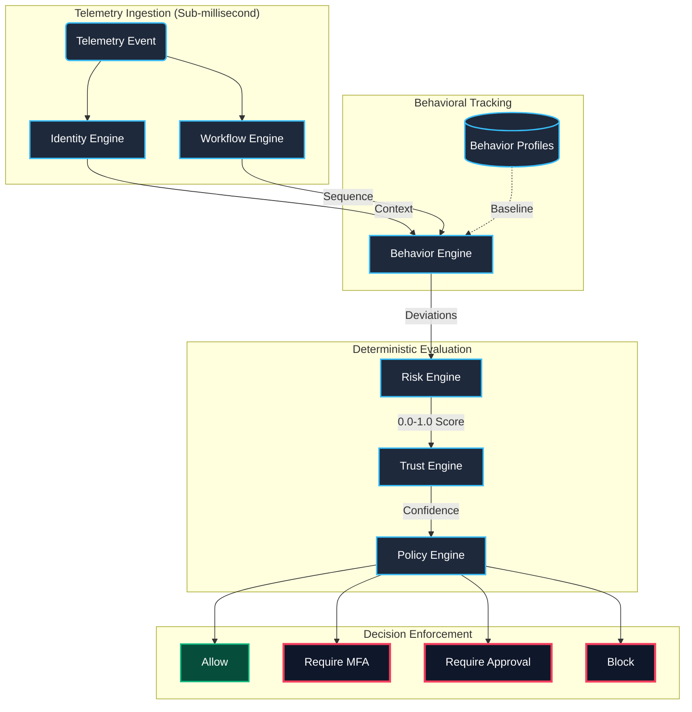
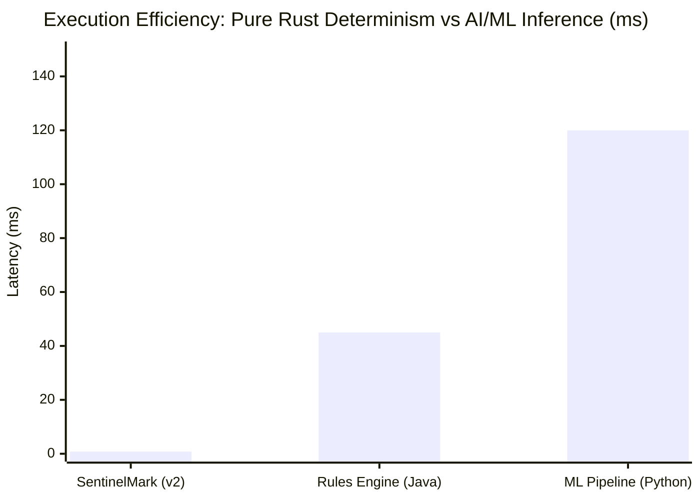

<h1 align="center">
  
</h1>

<p align="center">
   
</p>

<p align="center">
  <a href="LICENSE"></a>
  <a href="https://www.rust-lang.org"></a>
  
  
  <a href="https://python.org"></a>
  
</p>

**SentinelMark** is a **Behavior-Aware Continuous Trust Infrastructure Platform**. Evolving from a cryptographic watermarking and forensic telemetry subsystem (v1) into a comprehensive, enterprise-grade security SDK (v2), SentinelMark redefines how systems evaluate user authenticity.

While traditional authentication mechanisms ask, *"Did the user log in?"*, SentinelMark continually assesses: **"Can the user still be trusted right now?"** 

By fusing long-term static hardware secrets with live, continuous behavioral entropy snapshots, SentinelMark ensures that emitted telemetry cannot be forged, replayed, or fabricated, providing an unshakeable foundation for high-stakes digital environments.

---

## 🌟 SentinelMark v2: Continuous Trust Infrastructure SDK

In **v2**, SentinelMark has matured into a robust, deterministic, and blockchain-agnostic trust authorization layer. External enterprise systems—such as automated treasuries, identity gateways, and high-security workflows—consume SentinelMark to dynamically authorize critical actions based on real-time behavior.

The architecture is driven by 7 deterministic Rust engines:

| Engine | Responsibility |
|---|---|
| **Identity Engine** | Detects impossible-travel scenarios, novel device footprints, and credential reuse signals. |
| **Workflow Engine** | Tracks session action sequences and identifies anomalous workflow deviations. |
| **Behavior Engine** | Maintains historical behavioral profiles (typical usage hours, geolocation regions, and transaction volumes). |
| **Risk Engine** | Quantifies deviations into deterministic, mathematically weighted Risk Assessments (0.0–1.0). |
| **Trust Engine** | Inverts and scales raw risk into a dynamic, actionable Trust Score. |
| **Policy Engine** | Enforces strict, customizable boundaries (`Allow`, `RequireMFA`, `RequireApproval`, `Block`) via an Abstract Syntax Tree (AST). |
| **Explainability Engine** | Generates human-readable, compliance-ready narratives justifying every automated decision. |

> **Integration:** Delivered as a highly optimized **Rust SDK** (`sentinelmark-rs`), wrapped in a fully-featured **REST API Gateway** (Axum) for seamless enterprise deployment, alongside a modern **Next.js Enterprise Dashboard**.

---

## 🔬 Core Derivation Primitive (v1 Legacy Foundation)

<div align="center">
  
</div>
<br/>

Valid watermark tokens require the strict mathematical intersection of both the secret key and the instantaneous runtime behavioral state of the host device.

The derivation equation is defined as:

$$W_i = \text{HKDF-SHA256}(K_{\text{static}} \parallel \text{BehaviorFingerprint}_i \parallel H_{\text{prev}})$$

Where:
* **$K_{\text{static}}$**: The long-term static device secret (securely zeroized from stack/heap post-derivation).
* **$\text{BehaviorFingerprint}_i$**: A deterministic serialization of the live rolling behavioral entropy snapshot (CPU scheduling jitter, thread allocations, virtual/physical memory boundaries).
* **$H_{\text{prev}}$**: The SHA-256 hash commitment linking the current event to its immediate predecessor, establishing an unforgeable, append-only chronological hash chain.

---

## 🚀 Subsystem Architecture

<div align="center">

</div>
<br/>

The architecture is highly modularized and distributed across specialized sub-engines built entirely in safe Rust, utilizing strictly audited constant-time FFI primitives.

```text
sentinelmark_core (Rust Core Engine)
+-- behavior  -- Runtime behavioral entropy capture (CPU, virtual/physical memory, OS Jitter)
+-- crypto    -- Core audited wrappers (HKDF-SHA256, SHA-256 via ring, constant-time comparisons via subtle)
+-- watermark -- BEW Derivation engine enforcing StaticKey drop-zeroization
+-- chain     -- Append-only cryptographic hash chain manager & link verifier
+-- telemetry -- Dual-serialization schema (serde JSON + zero-copy rkyv) & pre-image projection logic
+-- verifier  -- Remote validation logic incorporating sliding-window replay detection
+-- transport -- Resilient async dispatch queue with immutable envelopes & exponential backoff

verify-py (Python Verification Authority)
+-- api          -- FastAPI ingestion endpoints (/ingest, /verify, /health)
+-- schemas      -- Pydantic validation mapping exact 256-bit payload constraints
+-- verification -- Constant-time logic recomputing BEW watermarks via OpenSSL C-bindings
+-- trust        -- Deterministic scalar trust scoring evaluation engine
```

### Advanced Security Features
* **Behavioral Entropy Sampler**: Captures live metrics alongside high-resolution OS scheduler jitter measurement. Jitter acts as a stochastic anti-tampering constraint.
* **Append-Only Hash Chaining**: Prevents log reordering, deletion, or insertion attacks. Any structural manipulation permanently corrupts subsequent chain linkages.
* **Hardened Replay Protection**: Features O(1) Nonce Caches, tight timestamp drift validation, and self-pruning queues to eliminate arbitrary memory expansion.
* **Async Telemetry Transport Layer**: Pre-serializes canonical payloads to protect nonces and timestamps from shifting across TCP reattempts.
* **Cross-Language Binary Parity**: Ensures deterministic serialization between Python and Rust environments, critical for `BehaviorFingerprint_i` computation.
* **Adversarial Attack Simulation**: Built-in frameworks simulate replay, forgery, and entropy-collapse vectors to continuously validate system resilience.

---

## 📊 Performance & Security Trade-offs

<div align="center">

</div>

---

## 🛡️ Security Best Practices Enforced

1. **Constant-Time Verification**: All security-critical array and digest comparisons pass directly through `subtle::ConstantTimeEq` to completely neutralize timing side-channel attacks.
2. **Key Material Zeroization**: Static secret arrays implement `zeroize::ZeroizeOnDrop` ensuring sensitive key material is wiped directly from register arrays and stack pointers immediately upon scope exit.
3. **Immutability Boundaries**: Payloads are locked into immutable arrays prior to dispatch. Network transport cannot modify context states.

---

## 📦 Getting Started

### Prerequisites
* **Rust** Toolchain `1.75` or higher — for the Core Engine and API Gateway.
* **Python** `3.10+` and `pip` / `poetry` — for Legacy Verification scripts.
* **Node.js** `18+` — for the Next.js Enterprise Frontend.

### Rust API Gateway & SDK
```bash
# Run tests for the Rust SDK and Policy Engine
cargo test --workspace

# Start the Axum API Gateway
cargo run -p api-gateway
```

### Next.js Enterprise Frontend
```bash
cd frontend
npm install
npm run dev
# The Policy Builder and Dashboard will be available at http://localhost:3000
```

### Adversarial Attack Simulations (Python)
```bash
cd verify-py
python benchmarks/attacks/sim_replay.py          # ATK-01: Replay attack
python benchmarks/attacks/sim_entropy_collapse.py # ATK-02: Forgery attack
# Results written to benchmarks/results/
```

---

## 📜 Usage Example (v2 SDK)

```rust
use sentinelmark_rs::SentinelMark;
use telemetry_engine::{TelemetryEvent, ActionType};

// Initialize the continuous trust SDK
let engine = SentinelMark::new();

// A high-value treasury transfer is attempted from an unknown region
let event = TelemetryEvent {
    user_id: UserId("alice123".to_string()),
    action_type: ActionType::Transaction,
    transaction_amount: Some(50_000.0),
    geo_region: "RU-Moscow".to_string(),
    // ... timestamps, device_id, IP
};

// Evaluate trust deterministically against the user's historical profile
let result = engine.evaluate(&event, &historical_profile);

println!("Decision: {:?}", result.decision); 
// Output: RequireApproval (Escalates to Multi-Sig)

println!("Explanation: {}", result.explanation);
// Output: "High risk (0.65). Significant behavioral anomalies detected."
```

---

## 📜 Usage Example (v1 Core Engine)

```rust
use sentinelmark_core::{
    behavior::BehaviorSnapshot,
    chain::{ChainManager, GENESIS_HASH},
    telemetry::TelemetryEvent,
    watermark::{StaticKey, WatermarkEngine},
};

// 1. Initialize Long-Term Secrets
let secret_key = StaticKey::from_bytes([0xAA; 32]);
let mut engine = WatermarkEngine::new(secret_key);
let mut chain = ChainManager::new();

// 2. Generate and Watermark Telemetry Payload
let payload = serde_json::json!({"action": "kernel_auth", "user_id": 1024});
// Bind device ID, monotonic sequence number, previous hash linkage, and payload
let mut event = TelemetryEvent::new("device-host-001", 1, GENESIS_HASH, payload).unwrap();

// Derive BEW Watermark binding current behavior digest, previous hash, and unique nonce
let snapshot = BehaviorSnapshot::capture().unwrap();
let behavior_digest = snapshot.to_digest();
let watermark = engine.derive(&behavior_digest, &event.prev_hash, &event.nonce).unwrap();
event.set_watermark(watermark.into_bytes());

// 3. Finalize Hash Linkage
event.finalize().unwrap();
chain.append(&event).unwrap();

// Payload is ready for immutable transport dispatch!
```

---

## 🎬 Step-by-Step Live Demo Script

Want to see SentinelMark in action? Follow these exact steps in your terminal to reproduce the security guarantees, attack prevention, and performance metrics.

### 1. Compile-Time Safety Guarantee (Rust Core)
```bash
cargo check
```
**What this proves:** Zero memory safety issues or undefined behavior. The Rust compiler enforces our security guarantees at compile time.

### 2. Cryptographic Subsystem Verification
```bash
cargo test --workspace
```
**What this proves:** All core cryptographic unit tests pass (hash chain integrity, watermark derivation, replay detection).

### 3. Defeating 7 Attack Vectors (Python Verifier)
```bash
cd verify-py
python -m pytest tests/ -v
```
**What this proves:** The system correctly handles every major attack scenario:
* **Forged Watermarks:** Rejected in constant-time (neutralizing timing oracles).
* **Replay Attacks:** Penalized trust scores and rejected duplicate nonces.
* **Timestamp Skew:** Rejects events outside the 60-second valid window.
* **Entropy Collapse:** Flags synthetic/repetitive behavior as compromised.

### 4. Volumetric Flood Stress Test
```bash
cd verify-py
python benchmarks/attacks/sim_volumetric_replay.py
```
**What this proves:** Simulates an adversary flooding the server with 10,000 events (50% replays). 
* **Performance:** Reaches ~1,794 events/sec verified throughput on SQLite WAL.
* **Accuracy:** Exactly 5,000 replays correctly identified and rejected with zero false positives.

---

## 🎓 Author & Attribution

**Bibek Das**  
* B.Tech Scholar, **Electronics and Communication Engineering (ECE)**  
* **Guru Nanak Institute of Technology**  
* Email: [bibekdas1055@gmail.com](mailto:bibekdas1055@gmail.com)  
* GitHub: [@Be-bibek](https://github.com/Be-bibek)  

---

## ⚖️ License

This project is open-sourced under the **Apache License 2.0**. See the [LICENSE](LICENSE) file for complete details and patent grant conditions.

<br/>

<div align="center">
  
</div>
